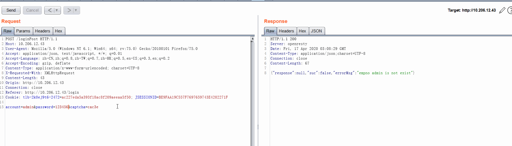
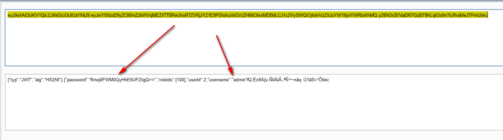

# secqa 安全知识问答

本文档主要总结日常工作中，业务方（开发人员）的常见问题。有关于技术的，也有其他奇葩问题。

## 一、架构评审常见问题

Q:系统初始阶段，要注意哪些问题？


Q:我想要学习安全测试，如何入门？


## 二、安全漏洞常见问题

### 账号体系相关问题

#### 1、为什么需要验证码？

​		以登录接口为例，验证码的作用了为了防止攻击者通过自动化工具或脚本进行大量重复请求，实现账号密码组合的不断尝试，从而获取正确账号和密码的可能。

#### 2、我已经接入了验证码？为什么还是不行？

​		验证码的正确使用姿势：仍以登录接口为例，验证码和账号密码等参数一起传递给服务端。服务端首选校验验证码：如果验证码正确，立即使当前验证码失效，然后进行后续接口操作（验证账号密码）；如果不正确，不执行任何操作；如果验证参数为空，也不应执行后续操作。

常见错误姿势：

- 验证码在单独的接口中校验，实际完成动作的接口于验证码不在同一接口
- 验证码未能做到一旦验证理解失效，可多次重复使用。
- 当接口未附带验证码参数，服务端逻辑也能进入到后续正常逻辑。




#### 3、弱密码问题怎么修改？密码的强度要求是什么？

​	密码的强度要求如下：

1. 密码长度最小值：10位。

2. 密码复杂度要求：3种(大写字母、小写字母、数字、特殊字符中任选3种)。

3. 密码最长使用期限：90天。 

4. 注意必须在服务端接口进行校验，js校验无效

5. 应当在注册、修改密码、重置密码等所有密码相关接口使用该策略

   

#### 4、新建用户的密码生成方案

1、生成随机密码，通过短信或邮箱方式通知用户
2、如果使用相同初始密码，必须强制要求第一登录时修改密码，不修改密码不允许访问系统（必须是服务端检查，前端JS检查无效）。且密码强度必须符合要求


### **权限相关漏洞问题**


#### 5、什么是越权漏洞？我想要复现这个漏洞如何进行？如何修复？

某个账号或人可以访问ta【本不应该访问到的接口】，可以获取到【本不应该获取到的数据】的问题的总称。

越权漏洞复现方法：

1. 通过管理员账号（最高权限账号）登录系统并进行各种系统操作，这些操作会触发HTTP请求，通过代理工具（[burp suite](https://portswigger.net/burp/communitydownload)）拦截请求数据包；
2. 替换其中的cookie或token为普通用户（低权限账号、甚至无任何权限账号）的cookie或token；
3. 取消对HTTP请求的拦截，如果发现该请求能够成功完成请求对应的操作，证明存在越权漏洞。
4. 你也可以使用postman等工具进行，核心就是：用低权限账号的身份标识（cookie、token）替换掉高权限的身份标识来完成HTTP请求，通过操作是否成功来判断是否越权。

越权漏洞修复思路：

每个重要接口进行具体的操作前（比如数据的增、删、改、查）都应该**<u>在服务端校验</u>**当前用户的权限（或者所在角色的权限），如果有权限则继续完成操作，否则拒绝。

常见的错误修复方式：只是前端不展示对应菜单，仍然未在服务端进行校验。


#### 6、什么是未授权访问？如何修复？

与越权漏洞相似，都是攻击者可以访问到【本不应该被访问到的接口】，或获取到【本不应该被获取的数据】。不同的是，未授权访问漏洞不需要登录系统，不需要提供有效的cookie等标识用户身份的信息就可成功访问系统，或者系统中的接口（成功是指能够完成增删查改等操作）。

未授权访问修复方法：

与越权漏洞的修复方案一样，每个接口都需要判断当前请求提供的身份信息是否有效，并且通过权限的判断才能进行具体的操作。可以通过全局filter实现。


#### 7、XSS漏洞的修复方法？

XSS解决方案：

1. 对用户输入的数据进行严格过滤，包括但不限于以下字符及字符串 Javascript script src img onerror { } ( ) < > = , . ; :  " ' # ! & / * \
2. 根据页面的输出背景环境，对输出进行编码
3. 使用一个统一的规则和库做输出编码
4. 对于富文本框，使用白名单控制输入，而不是黑名单
5. 在Cookie 上设置HTTPOnly 标志，从而禁止客户端脚本访问Cookie


#### 8、fastjson反序列化漏洞的修复方法

反序列化漏洞都是危害极高的漏洞，攻击者可以通过漏洞执行任意的系统命令，从而导致控制系统服务器，获取系统数据等危害。
修复方案：

1、使用gson替换fastjson，强烈推荐使用这个方案。

2、升级fastjson到当前的[最新版本](https://github.com/alibaba/fastjson/releases)，不推荐的方案，因为fastjson使用黑名单机制修复漏洞，很可能被不断绕过导致需要不断升级。


#### 9、XXE漏洞的修复方案

https://cheatsheetseries.owasp.org/cheatsheets/XML_External_Entity_Prevention_Cheat_Sheet.html


#### 10、Excel XXE漏洞的修复方案

如果系统使用了低版本POI库，导致处理Excel文件时存在XXE和SSRF漏洞，升级该库，必须大于3.14版本，最好是最新版本。
如果系统使用了Excel Streaming Reader <= 2.0.0 XXE 中，升级该库，必须大于2.0.0版本，最好是最新版本。


#### 11、跨域漏洞CORS\CSRF的修复方案？


服务端应当校验每个请求的origin或者Referer，只允许来自本域的请求，建议全局配置filter实现。值得注意的是，Firefox和chrome的行为不同，Firefox有可能不带Origin字段，所以最好校验Referer。


#### 12、我已经校验了referer了，为什么还不能通过？

获取URL中host的正确姿势：

```
package URLRedirect;

import java.net.MalformedURLException;
import java.net.URL;

public class referCheck {
     static boolean check(String urlstring){
          URL url;
          try {
              url = new URL(urlstring);
              String host = url.getHost();
              if (host.contains("\\") || host.contains("#")) {//getHost()方法可以被反斜线绕过，即returnUrl=http://www.evil.com\www.aaa.com会被代码认为是将要跳转到.aaa.com，而实际在浏览器中反斜线被纠正为正斜线，跳转到www.evil.com/www.aaa.com，最终还是跳到www.evil.com的服务器
                return false;
            }
              if (host.endsWith(".baidu.com")) {//the first dot is required!!!
                   return true;
              }else {
                   return false;
              }
          } catch (MalformedURLException e) {
              e.printStackTrace();
          }
          return false;
     }

     public static void main(String[] args) {
          System.out.println(check("http://abaidu.com"));
          System.out.println(check("http://baidu.com.a.com"));
          System.out.println(check("http://a.com?http://abaidu.com"));
          System.out.println(check(""));
          System.out.println(check("http://abaidu.com@baidu.com"));
     }
}
```

常见错误方式：

1、将referer值作为一个字符串，使用contains方法判断是否包含了当前域名或二级域名。

2、使用endsWith方法判断二级域名却少了最前面的点号。


---------------TODO------------

### Json Web Token相关

系统存在JWT弱密钥等问题

如果你使用了SFOPEN框架，框架升级指南：

JWT 泄露敏感信息



### 加密相关

**数据库账号密码加密**

https://stackoverflow.com/questions/10306673/securing-a-password-in-a-properties-file
https://blog.csdn.net/u011676300/article/details/80740530

**密码加密传输方案**：使用https或者自行加密传输，二者选其一即可

RSA加密传输参考https://www.cnblogs.com/hjtdlx/p/3944746.html

**密码加密存储方案**：至少采用【带salt】的SHA512。

注意不要弄混【加密传输】和【加密存储】，加密传输需要使用可解密的算法，服务器必须解密出原始密码后，进行密码强度判断。最后在数据库中存储的，必须是使用带salt的HASH算法计算后（不可逆）的结果。不能直接存储加密传输的密文！！！


**客户信息加密：**
系统涉及客户敏感信息，需要做如下处理：

1. 数据库中必须加密存储客户敏感信息（身份证，手机号，地址等），一般建议先做一次base64，然后AES256。
2. 系统中展示客户信息时应适当脱敏，接口返回的数据就需要是脱敏的。
3. 对客户信息的导出行为进行规范的日志记录，做到数据泄露可追溯！
4. 另外，顺丰机房、丰云上（走DCN区）的系统是可以调用硬件加密机的，不用自己实现。


## 三、其他灵魂拷问

#### 为什么每次安全测试都有新的问题？不能一次全部发现吗？

- 自动化只能发现简单的问题，并不能代替人工测试。
- 每个安全测试人员的思路和方法不一样，能发现的问题也可能不同。
- 系统在更新、代码在变、配置在变化、数据在变化，这些都可能导致出现新的问题。
- 我们的测试技术也在进步。以前没测试到的功能，现在测试到了。以前发现不了的问题，现在能发现了。
- 没有人能保证一次测试发现所有问题，就像你们不能保证没有bug是一个道理。
- 说句不好听的话，有没有问题，根本上还是取决于你们的代码，遇到某种类型的问题，希望可以多学习了解一下，后续自然就会越来越好。

#### 我的版本比有漏洞的版本高啊？我的系统中没有对应的Jar包啊？你是不是弄错了？

情况一：版本识别错误。

比如 fastjson 1.2.53 与 fastjson 1.2. 6  是 1.2.53 >1.2.6 而不是1.2.6 > 1.2.58，常常惯性思维，用小数的比较方法进行了大小的判断。

情况二：有漏洞的Jar包存在于其他Jar包当中。

有可能系统使用了自行打包的第三方包，而这个三方包包含了有楼的jar包。

情况三：远程调用服务存在漏洞

如果你的系统调用了远程服务，远程服务可能存在漏洞，所以在自己的业务里找不到对应的jar包。

